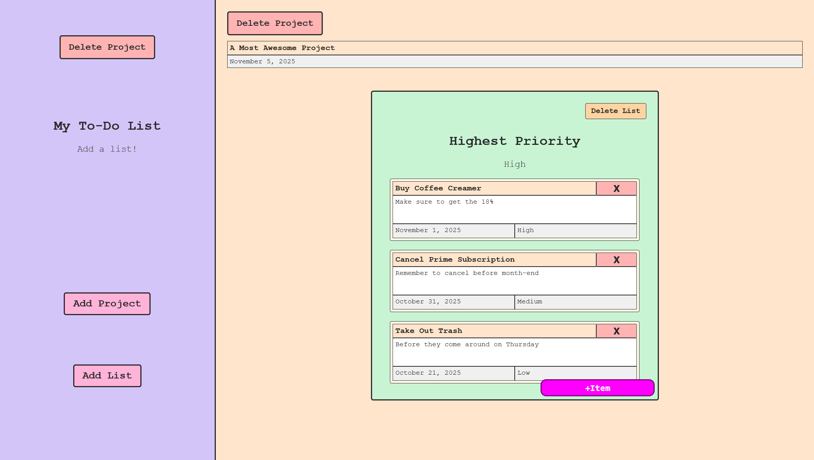

# Todo List - The Odin Project

**Live Demo**: [https://not-another-todo-list.netlify.app/](https://not-another-todo-list.netlify.app/)



A todo list application built from scratch using JavaScript, HTML, and CSS. This project was my capstone for the first half of The Odin Project's JavaScript course, where I learned to tie together many concepts I'd been practicing.

## What I Learned

This project taught me to:
- Create dynamic todo objects using classes with properties like title, description, dueDate, and priority
- Organize todos into separate projects and lists
- Separate application logic from DOM manipulation by using different modules
- Handle form submissions and prevent default browser behavior
- Create and manage dynamic DOM elements with event listeners

## Key Features

- **Project Creation**: Create projects with name and due date
- **List Management**: Add lists within projects with priority levels
- **Todo Items**: Add todos with title, description, due date, and priority
- **Delete Functionality**: Remove projects, lists, and items with confirmation
- **Dynamic Forms**: Context-aware forms that change based on what's being created

## Project Structure

```
src/
├── index.js              # Main entry point
├── global_scope.js       # Global state and UI setup
├── app_class.js          # Base application class
├── project_class.js      # Project class definition
├── list_class.js         # List class definition  
├── item_class.js         # Todo item class definition
├── _showForm.js          # Form display logic
├── _pushInputs.js        # Form data processing
├── _appendInputs.js      # DOM element creation
├── _delete.js            # Element deletion logic
├── dom_logic.js          # DOM manipulation utilities
├── styles.css            # Application styling
└── template.html         # HTML template
```

## Project Status

### Completed
- ✅ Project creation with name and due date forms
- ✅ List creation with priority selection
- ✅ Todo item creation with full details
- ✅ Dynamic DOM manipulation and display
- ✅ Delete functionality with confirmation dialogs
- ✅ Form handling and submission

### Challenges I Faced
- **Module Organization**: Learning to separate application logic from DOM concerns
- **State Management**: Managing data across different modules without a centralized state
- **Form Handling**: Preventing default form submission and managing popup overlays
- **Dynamic Elements**: Creating and managing event listeners on dynamically created DOM elements

## Running the Project

```bash
npm install
npm run dev    # Start development server
npm run bundle # Build for production
```

---
**Project Link**: [The Odin Project - Todo List](https://www.theodinproject.com/lessons/node-path-javascript-todo-list)
